# Streaming Time Series with SPSS Flow Modeler Hands-on Lab
(C) IBM 2019 - Ecosystem Advocacy Group Europe

Author: philippe.gregoire@fr.ibm.com

Reference Material:
* https://www.ibm.com/support/knowledgecenter/en/SS3RA7_sub/modeler_mainhelp_client_ddita/clementine/timeser_as_node_general.html

* https://www.ibm.com/support/knowledgecenter/en/SS3RA7_16.0.0/com.ibm.spss.modeler.help/clementine/streamingts_deploymenttab.htm#streamingts_deploymenttab

## Add input file as asset
Upload `broadband.csv` as file Data Asset.

## Create SPSS Flow with Modeler
### Setup flow with asset as input
1. Create new Modeler Flow: 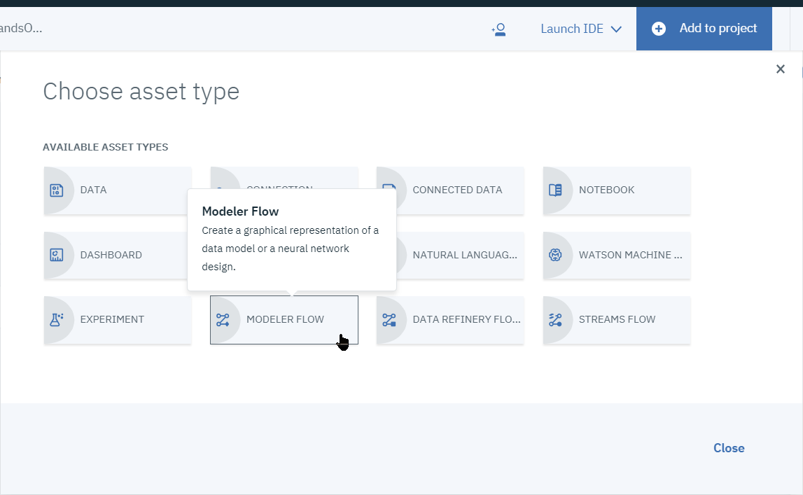
1. Give it a name, e.g. *SPSS Streaming TS*, making sure the type is *Modeler Flow* and runtime *IBM SPSS Modeler* 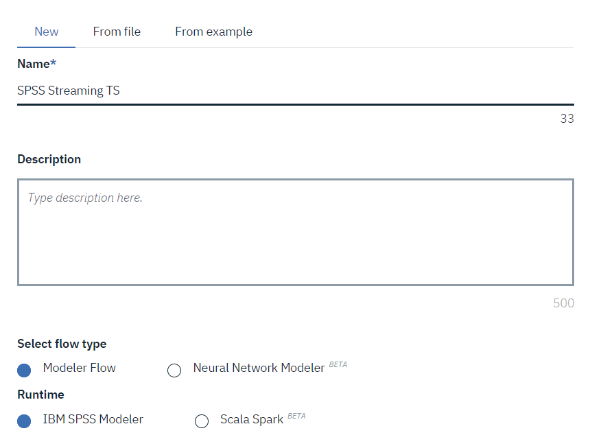
3. One the flow canvas is displayed, from the `Import` palette drawer, add a `Data Asset` node: 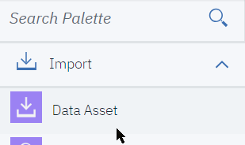
4. Open the node from its menu: 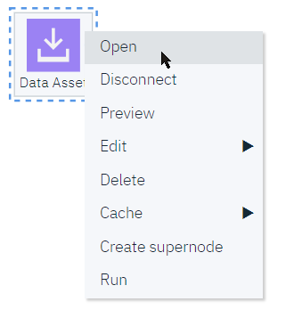
5. Set the Data Asset to the `broadband.csv` file 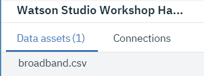
6. From the `Outputs` palette, drop a `Data Audit` node an wire it to the Data Asset node: 
7. Run the flow using the `Play` icon: 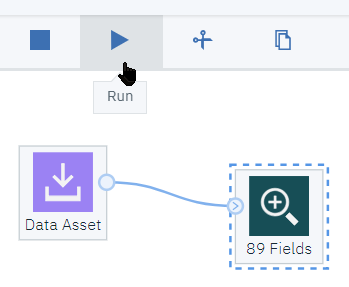
8. Switch to the View output tab on the right panel: 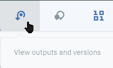
9. Open the Data Audit 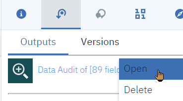
10. We get a summary of the data in the set, basically `Market_1` to `Market_85` columns with 60 rows each, a `DATE_` field

### Convert data into usable form
We will want to work on a subset of the markets, and use the `DATE_` column as the time indicator.
To get an understanding of the fields, we'll visualize them as a time plot:
1. From the `Graphs` drawer, select a `Time plot` node and wire it to the Data Asset node: 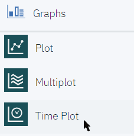
1. Open the `Time Plot` node 
1. Select the `DATE_` as custom X axis, uncheck *separate panel* and *normalize*: 
1. Add all the `Market_*` columns:  except `Total`, `YEAR_`, `MONTH_` and `DATE_` (Select all from the upper check box, then unselect the unwanted ones)   
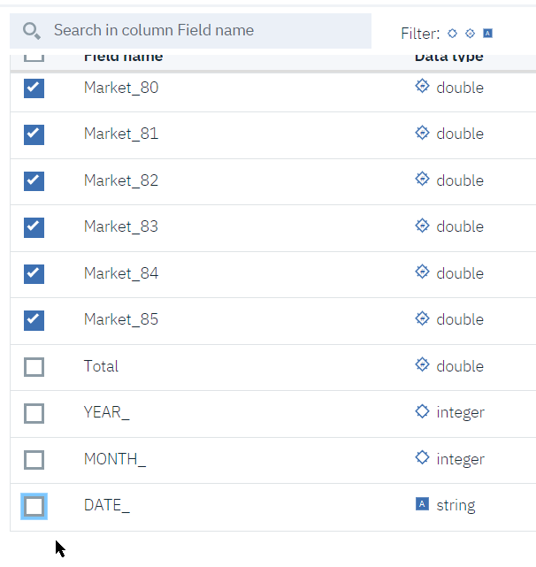
1. Now Run the graph node: 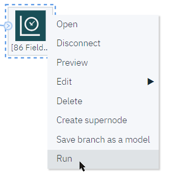
1. Open the graph 
1. This gives an idea of how the markets behave, all are more or less increasing, with various amplitudes.  To visualize relative volatility, you may want to re-run the graph node with `Normalize` checked.
9. In the filter node, select to retain fields, and keep only `Market_1` to `Market_5` and `DATE_`: 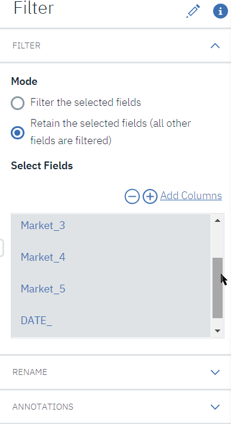
1. For the purpose of the lab, we will subselect only the 5 first markets. From `Field Operations` drop a `Filter` node and wire it to the Data Asset: 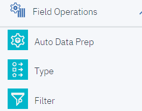
1. Add a `Filler` node and wire it after the `Filter` node. Setup the `DATE_` column to fill-in, with condition `Always` 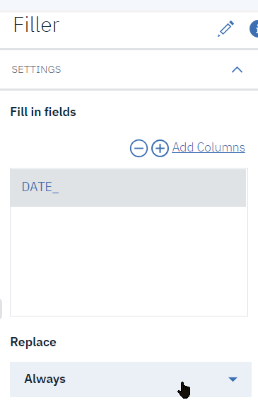
1. Set the `Replace with` formula to `to_date('DATE_')`: 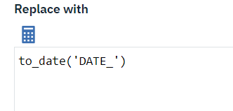
1. We will need to specify which fields are to be used as input or output. Add a *Type* node and wire it after the *Filler* node: 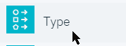

## Build the Streaming TimeSeries
1. Setup the *Type* node so that the `Market_*` fields have a role of `Both`, while the `DATE_` field has a role of `Input`: 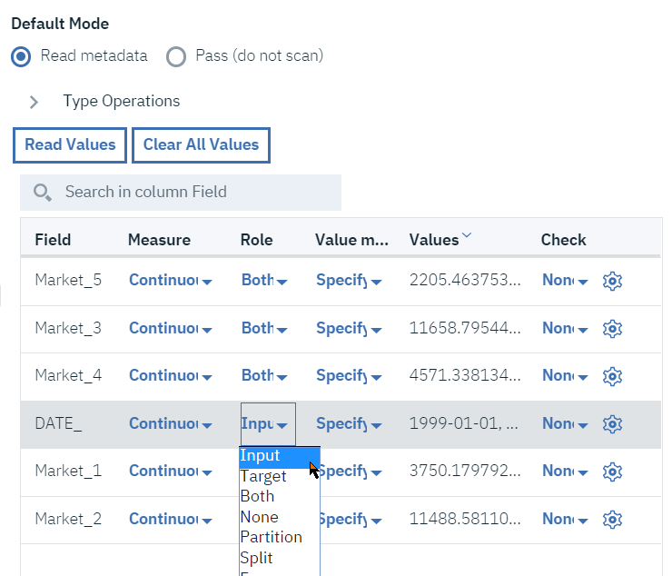
1. From `Record Operations` add a `Streaming TS`  node and wire it after the *Type* node.
1. Setup the *Streaming TS* node, add the `Market_*` fields both as *Targets* and *Candidate Input*: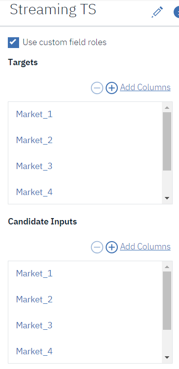
1. In *OBSERVATIONS AND TIME INTERVAL*, setup `DATE_` as Date/Time field, `Months` for time interval, `1` for the increment.
1. In *MODEL OPTIONS*, setup *Expert Modeler*, for all models, and select both *Seasonal* and *Sophisticated Exponential Smoothing* methods: 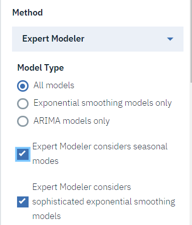
1. Then setup forecast to `5` records in the future, and select confidence and residuals computation: 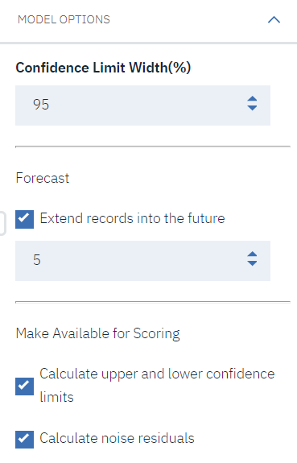
1. Add another *Time Plot* node from the `Graphs` drawer and wire it after the Streaming node. Setup the node so that it displays the `Market_1` columns. You may need to run the node once to materialize the colums. We will get additional columns for the predictions:
   * `$TS-Market_1`: the sliding window prediction
   * `$TSLCI-Market_1` and `$TSUCI-Market_1`: the Lower and Upper Confidence Indicators for the prediction.
     * `$TSResidual-Market_1`: the computed residuals of prediction vs actuals
1. Add the `DATE_` as X axis label: 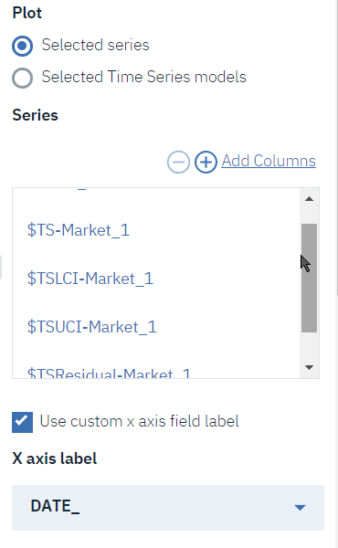
1. Run the graph and then display it: 
1. You may wantto do the same for e.g. `Market_2` field

## Deploy Streaming TimeSeries model
1. In order to get the output of the deployment, add a `Table` node from the *Outputs* drawer, and wire it to the *Streaming TS* node: 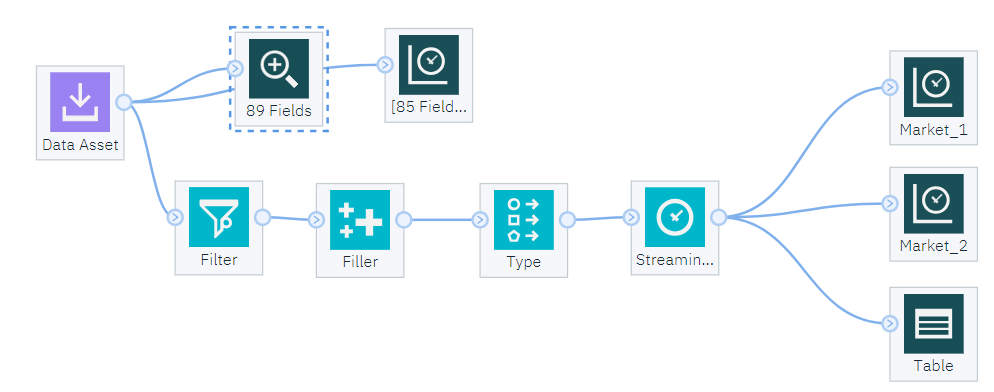
1. From the *Table* node menu, select `Save branch as model`: 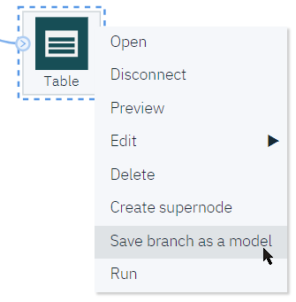.
   Note that you may be prompted to create a Watson Machine Learning instance at this stage.
1. In the *Save Model* panel, make sure the `Table` branch is selected as terminal node, give it a name, e.g. `Markets_Predictions` and save: 
1. We will now deploy the model as a REST API endpoint. Switch back to your project, locate you newly saved model in the *Models* section and select *Deploy* from its menu: 
1. In the net panel, select `(+) Add Deployment`: 
1. Give it a name, e.g. `REST_Market_Predict`, and `[Save ]`: 
1. You may have a look at the REST service definition, especially the implementation tab will show among other languages the Python client code to invoke prediction. 

## Invoke the REST endpoint from a notebook
We could test the deployed service from the Cloud UI interface, but the volume of input data does not make it very practical.   
So, we will use a Python Jupyter notebook to test and display predictions.

1. The test notebook has been prepared for you. It is derived from the Python implementation sample code, but is using the WML Python wrapper library to find the model named `Markets_Predictions`. The WML python client library is documented at https://wml-api-pyclient.mybluemix.net/
1. Switch back to your project and add an asset of type *Notebook*: 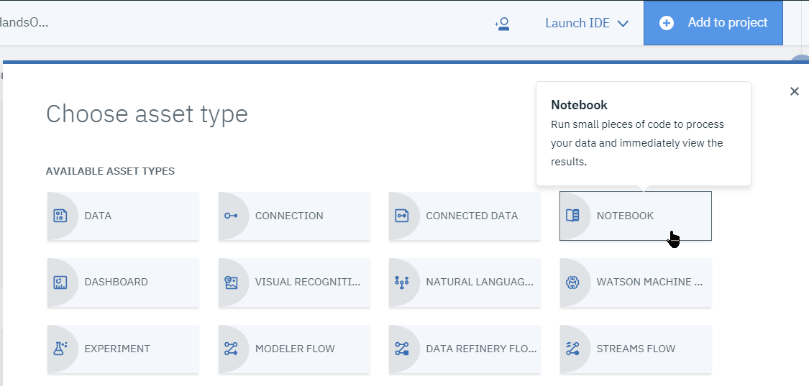
1. Switch to the *From file* tab, and choose  `WML_StreamingTS_Predictions.ipynb` notebook, select the 'Default Python 3.5 Free' environment: 
1. You will need to specify your own Cloud Object Storage (COS) and Watson Machine Learning (WML) credentials.
1. Locate the cell which contains `cos_credentials = {`, open the data asset panel on the right, and from the `broadband.csv` file, select `Insert to code/Insert Credentials` to override the existing assignement. Make sure the variavle name is `cos_credentials` and not `credentials_1`: 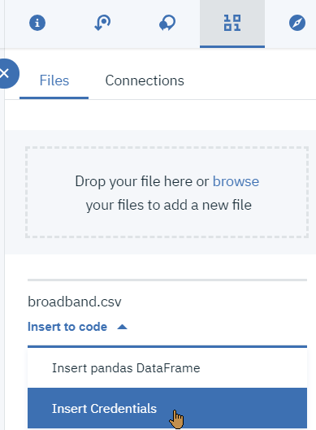
1. Locate the cell which contains `wml_credentials = {`. To find out your credentials, open the 'hamburger' menu at the top left, then open *Services/Watson Services* in a new tab: 
1. Select the WML service instance that you have configured for your project, and select *Manage in IBM Cloud* from its context menu: 
1. Open *Service Credentials*, and copy the contents of the `wdp-writer` credentials: 
1. Paste the credentials to replace the value of `wlm_credentials` in the notebook cell.